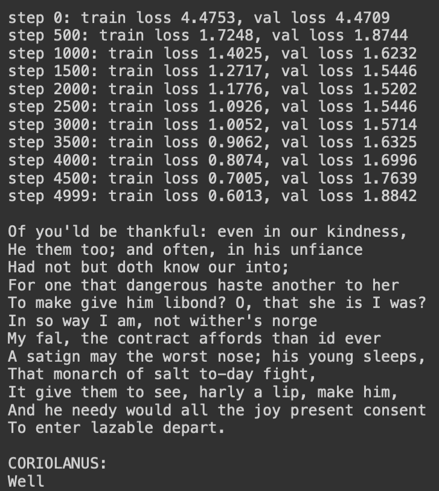
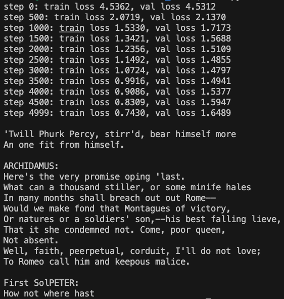
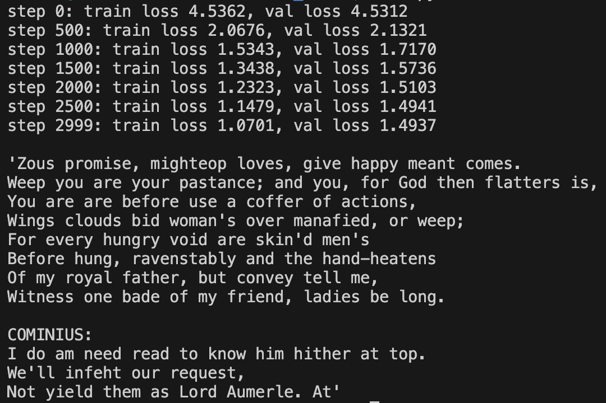
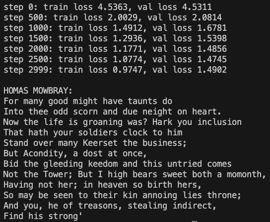

# nanoGPT
Model based on [Andrej Karpathy's nanoGPT lecture](https://youtu.be/kCc8FmEb1nY)

## Basic Explanation
* Simple [Transformer model](https://arxiv.org/abs/1706.03762)
* Original Transformer model's purpose was to translate language A to B (which is why it has encoder and decoder)
* This model only has decoder since its purpose is to mimic the dataset
* This model generates texts based on Shakespeare text dataset
* Trained on A10 and A100 - I used [Lambda Labs](https://lambdalabs.com) (not sponsered, paid on my own.)

## Experiments
* These are some experiments I did by changing some parameters.
### Experiment 1
* Parameters for **Experiment 1**
  ```python
  batch_size = 64
  block_size = 256
  max_iters = 5000
  eval_interval = 500
  learning_rate = 3e-3
  eval_iters = 200
  n_embd = 384
  n_head = 6
  n_layer = 6
  dropout = 0.2
  ```
  

### Experiment 2
* Parameters for **Experiment 2**
```python
  batch_size = 128
  block_size = 512
  max_iters = 5000
  eval_interval = 500
  learning_rate = 1e-3
  eval_iters = 200
  n_embd = 384
  n_head = 6
  n_layer = 6
  dropout = 0.5
  ```
  

### Experiment 3
* Parameters for **Experiment 3**
```python
  batch_size = 128
  block_size = 512
  max_iters = 3000
  eval_interval = 500
  learning_rate = 1e-3
  eval_iters = 200
  n_embd = 384
  n_head = 6
  n_layer = 6
  dropout = 0.5
  ```
  

### Experiment 4
* Parameters for **Experiment 4**
```python
  batch_size = 256
  block_size = 512
  max_iters = 3000
  eval_interval = 500
  learning_rate = 1e-3
  eval_iters = 200
  n_embd = 384
  n_head = 6
  n_layer = 6
  dropout = 0.5
  ```
  

## To-dos
* Make notes for Transformer model
